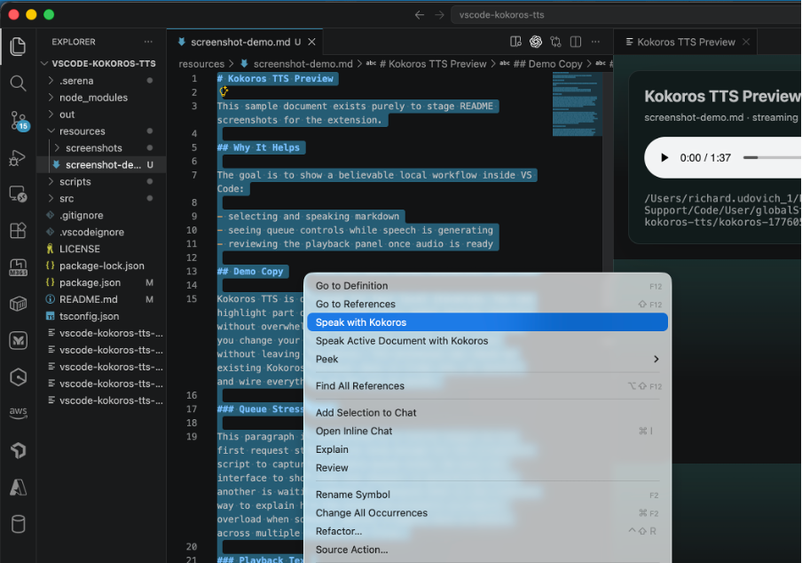
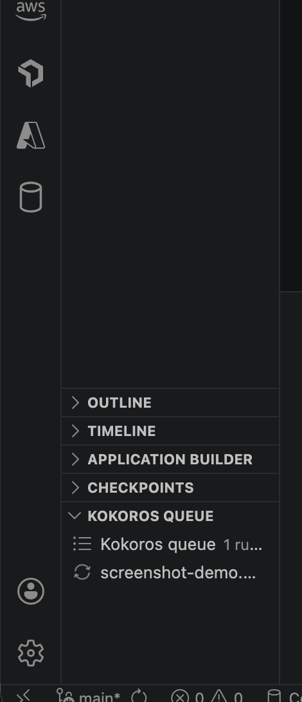
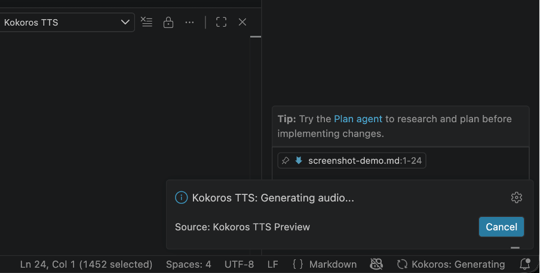
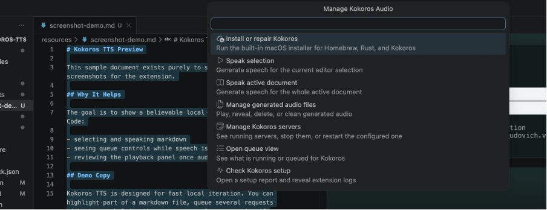
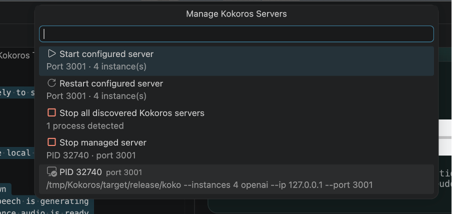
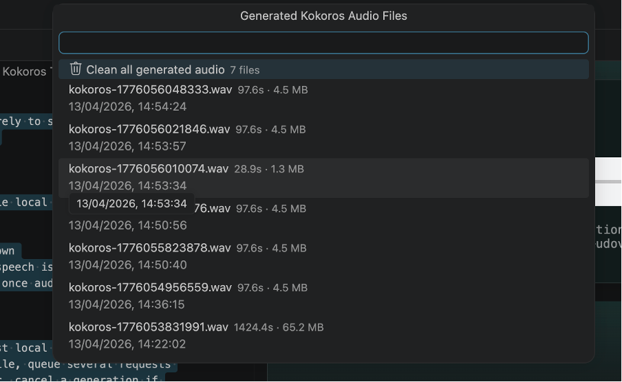
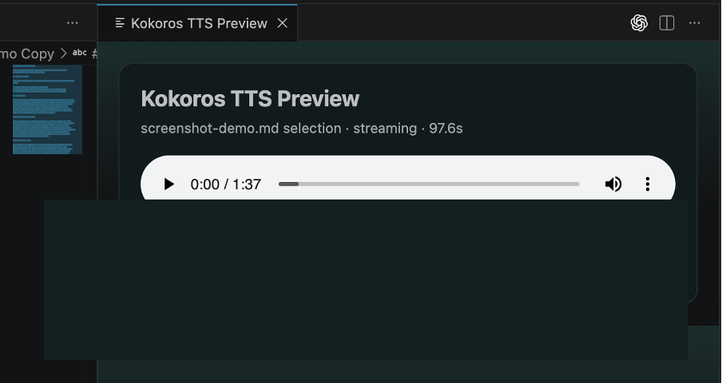

# Kokoros Local TTS

[](https://github.com/richardudovich/vscode-kokoros-tts/actions/workflows/ci.yml)
[](https://codecov.io/gh/richardudovich/vscode-kokoros-tts)
[](https://marketplace.visualstudio.com/items?itemName=RichardUdovich.vscode-kokoros-tts)
[](https://marketplace.visualstudio.com/items?itemName=RichardUdovich.vscode-kokoros-tts)

Speak selected markdown or text from VS Code using a local [Kokoros](https://github.com/lucasjinreal/Kokoros) server.

This extension is built for a fast local workflow:

- select part of a markdown file or a full document
- right-click and choose `Speak with Kokoros`
- hear the result in a side playback panel
- optionally highlight the text as the audio plays

The extension talks to Kokoros through its local OpenAI-compatible HTTP server.

## Features

- Right-click command for editor selections
- Command to speak the full active document
- Auto-detects existing Kokoros installs and checkouts in common local locations
- Auto-start, stop, and restart commands for the local Kokoros server
- Configurable worker instance count, voice, port, speech speed, and markdown cleanup
- Streaming mode for better latency and better long-text throughput
- Estimated playback highlighting for markdown or prose selections

## Screenshots

### Speak from an editor selection



### Queue view



### Generation feedback



### Manage Kokoros audio



### Manage Kokoros servers



### Generated audio files



### Playback panel



## Requirements

- macOS, Linux, or another environment where [Kokoros](https://github.com/lucasjinreal/Kokoros) can run
- Node.js for extension development and packaging
- A built `koko` binary plus Kokoro model and voice data

On macOS, Kokoros needs:

```bash
brew install pkg-config opus cmake
```

## Quick setup

### Recommended: let the extension install Kokoros for you

Open the Command Palette and run:

- `Kokoros TTS: Install or Repair Kokoros`

Before doing a full install, the extension will first try to reuse an existing Kokoros build automatically. It checks:

- the current configured path, if you already set one
- `~/.local/share/Kokoros`
- `~/.local/share/kokoros`
- `/tmp/Kokoros`
- `koko` on your `PATH`

If it finds one, it wires `kokorosTts.kokorosExecutable` and `kokorosTts.kokorosWorkingDirectory` for you.

That opens an integrated terminal and runs the bundled installer. On macOS it will:

- install Xcode Command Line Tools if needed
- install Homebrew if needed
- install `git`, `pkg-config`, `opus`, and `cmake`
- install the Rust toolchain if needed
- clone or update Kokoros
- build the `koko` binary

By default that installs Kokoros into `~/.local/share/Kokoros` and builds:

```text
~/.local/share/Kokoros/target/release/koko
```

### Advanced override

If you want to force a specific checkout, you can still set:

- `kokorosTts.kokorosExecutable`
- `kokorosTts.kokorosWorkingDirectory`

## Extension settings

Open Settings and search for `Kokoros TTS`.

Important settings:

- `kokorosTts.kokorosExecutable`
- `kokorosTts.kokorosWorkingDirectory`
- `kokorosTts.port`
- `kokorosTts.instances`
- `kokorosTts.voice`
- `kokorosTts.speed`
- `kokorosTts.streamAudio`
- `kokorosTts.stripMarkdown`
- `kokorosTts.highlightMode`

Recommended starting values:

- `instances = 4` for longer markdown documents on Apple Silicon
- `streamAudio = true`
- `stripMarkdown = true`
- `highlightMode = estimated`

## Usage

### Speak a selection

1. Open a markdown or text document.
2. Select the section you want.
3. Right-click.
4. Choose `Speak with Kokoros`.

### Speak the active document

Run:

```text
Kokoros TTS: Speak Active Document with Kokoros
```

from the Command Palette.

### Manage the local server

Use the Command Palette:

- `Kokoros TTS: Install or Repair Kokoros`
- `Kokoros TTS: Start Server`
- `Kokoros TTS: Stop Server`
- `Kokoros TTS: Restart Server`
- `Kokoros TTS: Check Kokoros Setup`

## Development

Install extension dependencies:

```bash
cd /path/to/vscode-kokoros-tts
npm install
```

Compile:

```bash
npm run compile
```

Test the core logic:

```bash
npm run test
```

Generate a coverage report:

```bash
npm run test:coverage
```

Run the local verification bundle:

```bash
npm run verify
```

GitHub Actions runs compile + coverage on pushes to `main` and on pull requests.

## Release automation

Pushes to `main` can auto-publish the extension to both the Visual Studio Marketplace and Open VSX.

Required GitHub repository secrets:

- `VSCE_PAT` for the Visual Studio Marketplace publisher
- `OVSX_PAT` for Open VSX publishing

The publish workflow verifies the extension, bumps the patch version, publishes the same VSIX to both registries, and then pushes the release commit and tag back to `main`.

Run the extension in VS Code:

1. Open the `vscode-kokoros-tts` folder in VS Code
2. Press `F5`
3. In the Extension Development Host, test the `Kokoros TTS` commands

Package a VSIX:

```bash
npm run package
```

## Notes on highlighting

The current highlight mode is `estimated`, not word-perfect.

It splits the selected text into sentence or paragraph chunks and maps those chunks onto the final audio duration. That makes it useful for following along while staying lightweight and fast.

Future improvement path:

- switch to a timestamp-capable Kokoro model
- use exact token or word timings for highlight updates
